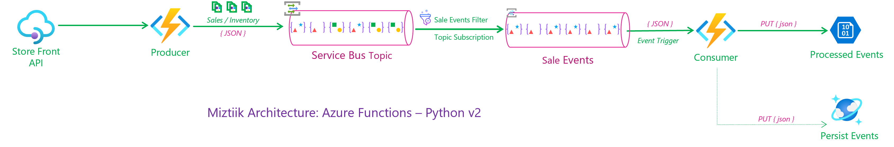

# LLM Bootcamp - W.I.P 

Simple app to demonstrate how to use Azure Functions with Python v2.



# Create the Resources.

The bicep template will create the following resources: Azure Function App, API Management, Backend Service and the APIM Policy for configuring the backend. We have not configured the APIM to use the client certificate yet.

```bash
make all
```

## 🎯 Test the solution

The API Url should be of the format `https://v2-store-front-us-apim-005.azure-api.net/api/miztiik_automation/store_events_producer`


```bash
LOAD_COUNT=250
TARGET_HOST="https://v2-store-front-us-apim-005.azure-api.net/api/miztiik_automation/store_events_producer"
for ((i=1; i<=LOAD_COUNT; i++)); do
    COUNT=$((1 + ${RANDOM} % 10))
    curl -s "${TARGET_HOST}?count=${COUNT}" &
    echo -e "Request: (${i}/${LOAD_COUNT}) with event count:${COUNT} ----"
    sleep 1 
done
```

You should be able to see a similar output,

```json
{
    "miztiik_event_processed": true,
    "msg": "Generated 1 messages",
    "event_count": 1,
    "resp": {
        "status": true,
        "tot_msgs": 1,
        "event_gen_duration": 20.317,
        "bad_msgs": 0,
        "sale_evnts": 1,
        "inventory_evnts": 0,
        "tot_sales": 1906.74,
        "sample_event": {
            "id": "5a6a4205-d0f8-4b12-bbc9-02039ac8824e",
            "event_type": "sale_event",
            "store_id": 2,
            "store_fqdn": "localhost",
            "store_ip": "127.0.0.1",
            "cust_id": 860,
            "category": "Printers",
            "sku": 99849,
            "price": 57.78,
            "qty": 33,
            "currency": "SGD",
            "discount": 33,
            "gift_wrap": true,
            "variant": "black",
            "priority_shipping": false,
            "is_promoted": false,
            "payment_method": "debit_card",
            "ts": "2024-01-05T12:54:00.191857",
            "contact_me": "github.com/miztiik",
            "is_return": false
        }
    },
    "last_processed_on": "2024-01-05T12:54:20.508823"
}
```

You can also check CosmosDB for the new records and blob storage for the new files.

 
1. ## 🧹 CleanUp

   If you want to destroy all the resources created by the stack, Execute the below command to delete the stack, or _you can delete the stack from console as well_

   - Resources created during [Deploying The Solution](#-deploying-the-solution)
   - _Any other custom resources, you have created for this demo_

   ```bash
   # Delete from resource group
   az group delete --name Miztiik_Enterprises_xxx --yes
   # Follow any on-screen prompt
   ```

   This is not an exhaustive list, please carry out other necessary steps as maybe applicable to your needs.

## 📌 Who is using this

This repository aims to show how to Bicep to new developers, Solution Architects & Ops Engineers in Azure.

### 💡 Help/Suggestions or 🐛 Bugs

Thank you for your interest in contributing to our project. Whether it is a bug report, new feature, correction, or additional documentation or solutions, we greatly value feedback and contributions from our community. [Start here](/issues)

### 👋 Buy me a coffee

[](https://ko-fi.com/Q5Q41QDGK) Buy me a [coffee ☕][900].

### 📚 References

1. [Azure Docs - APIM Emit custom metrics policy][1]
1. [Azure Docs - Monitor Custom Metric][2]


[1]: https://learn.microsoft.com/en-us/azure/api-management/emit-metric-policy
[2]: https://learn.microsoft.com/en-us/azure/azure-monitor/essentials/metrics-custom-overview

### 🏷️ Metadata


**Level**: 100

[100]: https://www.udemy.com/course/aws-cloud-security/?referralCode=B7F1B6C78B45ADAF77A9
[101]: https://www.udemy.com/course/aws-cloud-security-proactive-way/?referralCode=71DC542AD4481309A441
[102]: https://www.udemy.com/course/aws-cloud-development-kit-from-beginner-to-professional/?referralCode=E15D7FB64E417C547579
[103]: https://www.udemy.com/course/aws-cloudformation-basics?referralCode=93AD3B1530BC871093D6
[899]: https://www.udemy.com/user/n-kumar/
[900]: https://ko-fi.com/miztiik
[901]: https://ko-fi.com/Q5Q41QDGK