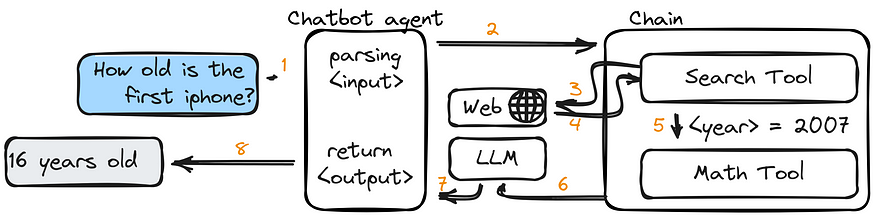

# What is LangChain 🦜🔗?

LangChain is an open source orchestration framework for the development of applications using large language models (LLMs). LangChain's tools and APIs simplify the process of building LLM-driven applications like chatbots and virtual agents.

 

- **Models IO:** LThe core element of any language model application is...the model. LangChain gives you the building blocks to interface with any language model.

  - **Models:** You can use LLMs or ChatModels within langchain library.

    

  - **Prompts:** Prompts are the instructions that you give to the LLM. Prompts instruct the LLM to do what you want it to do, and how you want it to do it. Prompts can take the form of a _string_ (for Language Models) or a _list_ of messages (for Chat Models).
  
    
- **Retrieval:** Many LLM applications require user-specific data that is not part of the model's training set. The primary way of accomplishing this is through Retrieval Augmented Generation (RAG). In this process, external data is retrieved and then passed to the LLM when doing the generation step. LangChain provides all the building blocks for RAG applications - from simple to complex.

    

  - **Document Loaders**: LangChain's Document Loader modules are used to load and manage documents and data. They can be used to _load and manage documents_, _extract information from documents_, and _store and retrieve documents_.
  - **Vector Stores**: A vector store takes care of storing embedded data and performing vector search for you.
  - **Indexes**: LangChain's Index modules are used to store and manage data. They can be used to _store and retrieve data_, _manage data storage_, and _index and search data_.
  
- **Agents:** LangChain's Agent modules are designed to integrate with existing workflows and systems. They can be used to automate tasks, provide information, and interact with users. They handle things like _parsing input_, _generating output_ and determining the sequence of actions to follow and tools to use.

    
  
  - **Chains**: LangChain's Chain modules are used to orchestrate the flow of data and actions between different models and agents. They can be used to _chain together multiple models_, _manage the flow of data_, and _handle the orchestration of tasks_.
  
    

## **LangChain Use Cases**

- **Chatbots:** Chatbots are among the most intuitive uses of LLMs. LangChain can be used to provide proper context for the specific use of a chatbot and to integrate chatbots into existing communication channels and workflows with their own APIs.

- **Summarization:** Language models can be tasked with summarizing many types of text, from breaking down complex academic articles and transcripts to providing a digest of incoming emails.

- **Question Answering:** Using specific documents or specialized knowledge bases (like Wolfram, arXiv, or PubMed), LLMs can retrieve relevant information from storage and articulate helpful answers. If fine-tuned or properly prompted, some LLMs can answer many questions even without external information.

- **Data Augmentation:** LLMs can be used to generate synthetic data for use in machine learning. For example, an LLM can be trained to generate additional data samples that closely resemble the data points in a training dataset.

- **Virtual Agents:** Integrated with the right workflows, LangChain’s Agent modules can use an LLM to autonomously determine next steps and take action using robotic process automation (RPA).

References
- [LangChain](https://python.langchain.com/docs/get_started/introduction)