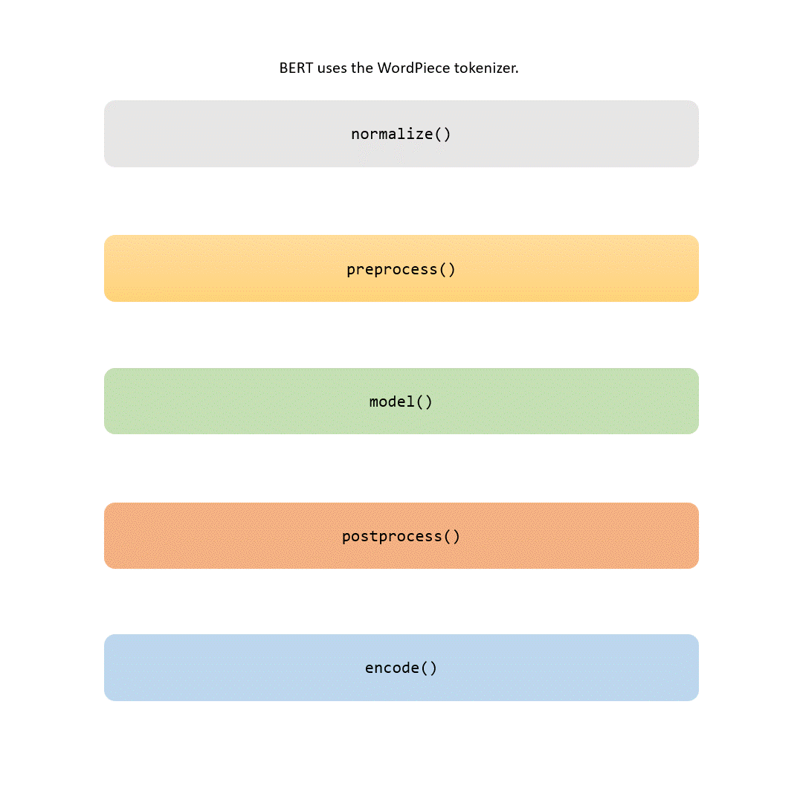
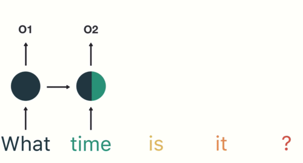
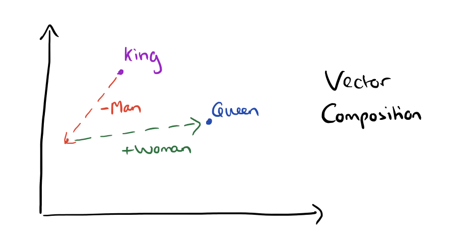

# Tokenization vs. Embedding: Understanding the Differences and Their Importance in NLP
`Tokenizer` and `Embedding` layers are indispensable elements for handling text data in natural language processing (NLP) projects. While serving distinct functions, they operate at varying stages within the NLP workflow. In this article, we delve into the distinctions between tokenization and embedding, highlighting their significance in NLP.

## Tokenization

Tokenization is splitting the input data into a sequence of meaningful parts. These meaningful parts are _encoded_ to tokens. These tokens are usually words that can also be phrases, punctuation marks, or even individual characters. Tokenization is the first step in NLP and is essential for text preprocessing. Sometimes we append special tokens to the sequence e.g. class token ([CLS]) used for classification embedding in BERT transformer.

A closer look into the encoding process reveals that the tokens are converted into integer sequences. This is done to make the data suitable for machine learning models and how the relationship between the tokens are considered,

Learn more about vectors here, Adrian Colyer explained this concept very nicely in his blog post [The amazing power of word vectors](https://blog.acolyer.org/2016/04/21/the-amazing-power-of-word-vectors/)

## Embedding

Embeddings refer to continuous vector representations of words or phrases that capture their meanings or relationships with other words. These vectors allow machines to understand human language contextually, enabling better text analysis and modeling.

Embeddings represent words as vectors, enabling models to grasp word meanings and context. For instance, compare "king," "queen," "man," and "woman" (as shown in the initial image). Related words like these can be characterized by embeddings. By subtracting "man" from "king" and adding "woman," we derive "queen." Embeddings harness this ability, revealing word relationships and enhancing model comprehension of text context.

In an embedding space, the vector difference between "king" and "queen" would be similar to the vector difference between "man" and "woman." This will be used in similarity search, word analogies, and other NLP tasks.

Use the Embedding layer when,

- You want to convert integer-encoded word sequences into dense word embeddings.
- You need to capture semantic information and context between words in a lower-dimensional space.

## Conclusion

In summary, the `Tokenizer` is used for text preprocessing and converting text data into numerical sequences, while the `Embedding` layer is used for creating word embeddings from the integer-encoded sequences. 

## Tokenization vs. Embedding - Try it Out

